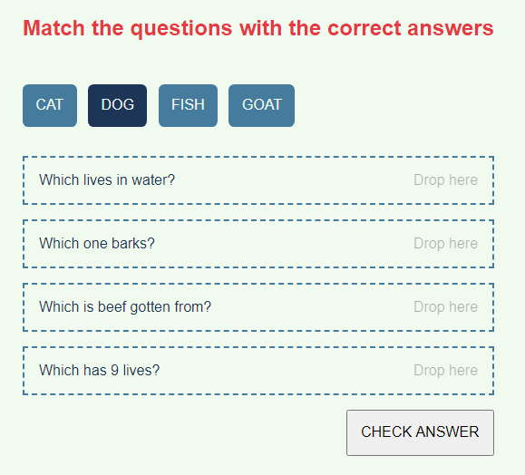

# Match Words Quiz
A simple web app where users are required to drag and drop answers to questions. They match an answer to a question. 

# Why I built this
This is a pretty simple app and that is why I choose it. I am using it to learn the following technologies and/or techniques:
- TypeScript
- BEM 
- SASS
- DRY principle
- UML diagramming

## Inspiration
I saw it in one of Udacity's course quiz and decided to build it out with technologies I was interested in learn

## Live project
The live project is available here: [https://olusamimaths.github.io/Match-Words-Quiz/](https://olusamimaths.github.io/Match-Words-Quiz/)

## Licence
MIT
## Author
Olusola Samuel
